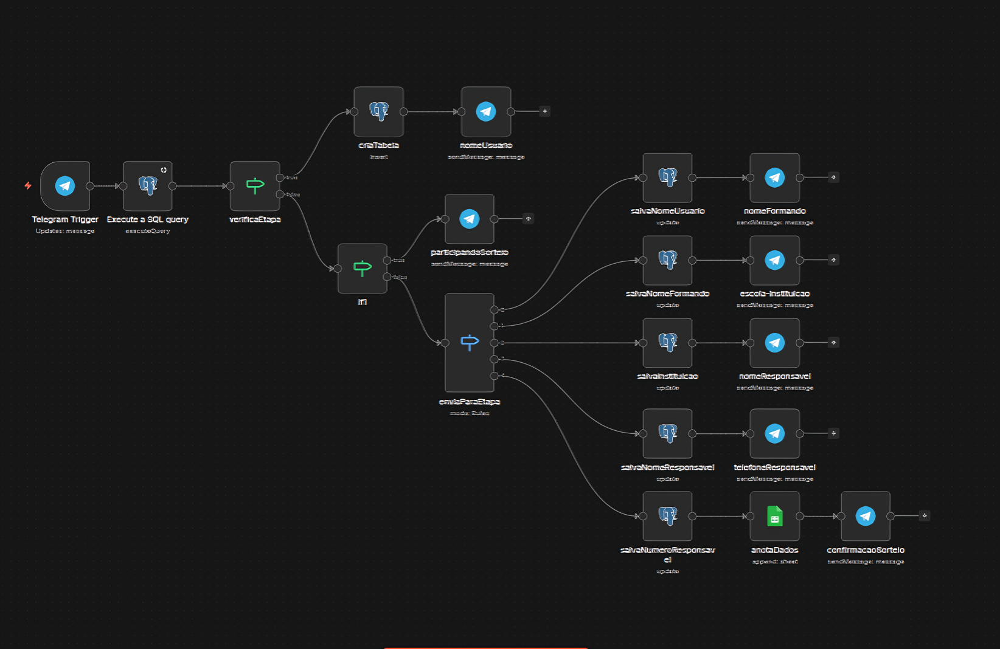

 # Automação de Sorteio via Chat

Sistema automatizado para cadastro e gerenciamento de participantes em campanhas promocionais via chat.

> ⚠️ Projeto desenvolvido utilizando Telegram, mas totalmente adaptável para WhatsApp via APIs (Z-API, Twilio, etc.)

---

## 📌 Problema
Empresas que realizam sorteios manualmente enfrentam:
- desorganização de participantes
- risco de duplicidade
- perda de dados
- alto esforço manual

---

## 🚀 Solução
Este sistema automatiza todo o processo de entrada e registro de participantes.

---

## ⚙️ Tecnologias
- n8n (automação de fluxos)
- PostgreSQL (armazenamento de dados)
- Telegram Bot API (interface de entrada)

---

## 🔧 Funcionalidades
- Cadastro automático de participantes via mensagem
- Validação de entrada
- Armazenamento estruturado em banco de dados
- Resposta automática ao usuário
- Estrutura pronta para expansão (WhatsApp, CRM, etc.)

---

## 🧠 Como funciona
1. Usuário envia mensagem com comando (ex: #QUEROGANHAR)
2. O sistema identifica e valida a solicitação
3. Dados são coletados automaticamente
4. Informações são armazenadas no PostgreSQL
5. Usuário recebe confirmação instantânea

---

## 🗄️ Banco de Dados

Execute no PostgreSQL antes de importar o workflow:

```sql
CREATE TABLE cadastro_formatura (
  chat_id TEXT PRIMARY KEY,
  etapa INTEGER DEFAULT 0,
  nome TEXT,
  nome_formando TEXT,
  escola TEXT,
  nome_responsavel TEXT,
  telefone TEXT,
  created_at TIMESTAMP DEFAULT NOW()
);
```

---

## 📂 Como usar
1. Executar a query SQL acima no PostgreSQL
2. Importar o arquivo JSON no n8n
3. Configurar credenciais (Telegram e banco de dados)
4. Ativar o workflow

---

## 📌 Observação
Este projeto pode ser facilmente adaptado para outros canais de comunicação e integrado com sistemas externos.
